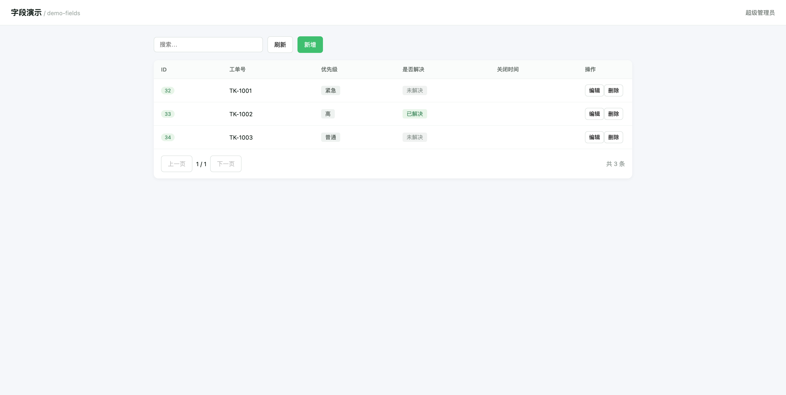
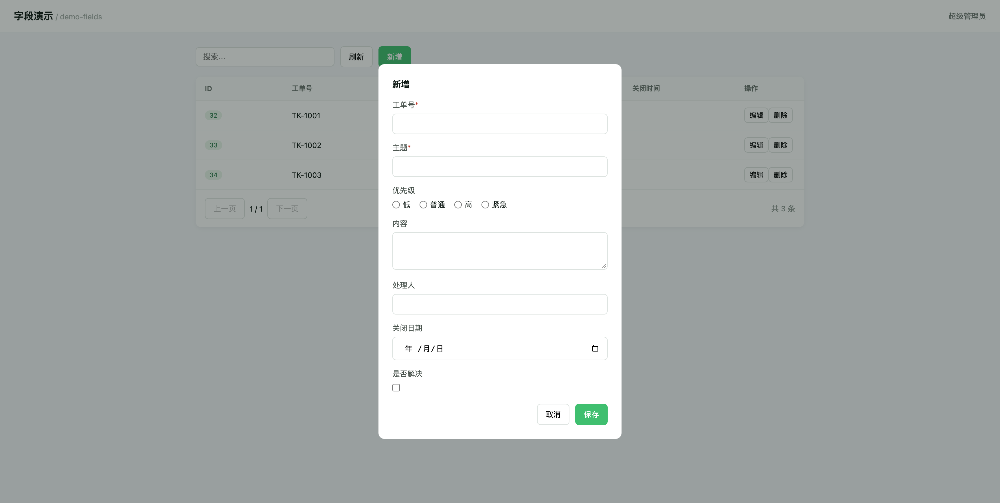
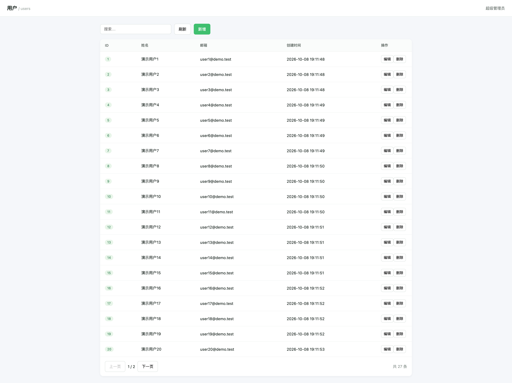

# AI 码农 · Aimanong

> **AI-First 后台开发框架** —— 让任何 AI Agent 在 5 分钟内理解框架、30 分钟内产出可运行的后台系统。

基于 **Laravel 12 + Vue 3**，专为 AI Agent 设计，同时为人类保留完整文档。

```
        斗笠 = 农   电路 = 码   新芽 = AI
        一个让代码自己长出来的农夫
```

## 为什么是 AI-First

传统后台框架（dcat-admin、Filament 等）的使用者是人，追求灵活与优雅。
AI Agent 的需求完全不同：**低歧义、可自省、可验证、错误可自愈**。

Aimanong 为此明确牺牲部分"灵活性"来换取"确定性"：

| 设计 | 目的 |
|---|---|
| 禁止方法重载、禁止嵌套闭包 | 降低 AI 生成歧义 |
| 一份声明 → Schema 编译出全部产物 | 消灭文档与实现漂移 |
| 自省 API + MCP Server | AI 无需"读文档"，直接调工具 |
| 错误带 `didYouMean` + 正确示例 | AI 一次改对 |

## 快速开始

> 开发中，尚未发布首个版本。参见 [开发计划](./internal-docs/开发计划.md)。

## 仓库结构

| 路径 | 说明 |
|---|---|
| `packages/framework` | 核心框架（Composer: `aimanong/framework`） |
| `packages/ui` | Vue 3 组件库（npm: `@aimanong/ui`） |
| `docs/` | 文档站（VitePress） |
| `demo/` | 示例项目 |

## 文档

- 📖 **[在线文档站](https://aimanong.com)** —— 人读这个（`cd docs && npm run dev` 本地预览）
- 🎮 **[Playground](/playground/)** —— 浏览器里改 Resource 声明，实时看四份产物
- 📝 **[四轮 AI 实测报告](/blog/ai-first-in-practice)** —— 15 个缺陷与三条教训
- [llms.txt](./llms.txt) —— **AI 读这个**
- [AGENTS.md](./AGENTS.md) —— **AI Agent 项目内约定**
- [API 参考](./docs/api/) —— **由 Schema 自动生成**，永不漂移
- [开发计划](./internal-docs/开发计划.md) —— 里程碑与排期
- [AI 实测记录](./internal-docs/AI实测记录.md) —— 三轮实测的完整数据

> 文档站用法：
> ```bash
> cd docs && npm install
> npm run dev              # 本地预览
> npm run docs:gen         # 从 Schema 重新生成 API 参考
> npm run build            # 构建静态站点
> ```

## 状态

| 里程碑 | 状态 | 说明 |
|---|---|---|
| M0 地基 | ✅ **完成** | Laravel 12.69.3 实测：安装、认证、登录、会话全部跑通 |
| M1 Schema 编译层 | ✅ **完成** | 一份声明 → 四份产物，漂移检测可阻断 CI |
| M2 核心 DSL + Vue | ✅ **完成** | CRUD API + Schema 驱动渲染，浏览器实测通过 |
| M3 AI 能力层 | ✅ **已完成并通过验收** | 自省 API + MCP Server；三轮 AI 实测，一次成功率 **1.0** |
| M4 字段与组件库 | ⬜ 下一个 | 字段类型与展示器扩充 |
| M4 组件库 | ⬜ | 字段与展示器 |
| M5 增强 | ⬜ | Tree / 分步表单 / 多应用 |
| M6 生态与文档 | ⬜ | 文档站 / 代码生成器 / v1.0 |

### M0 已交付

```
packages/framework/
├── src/
│   ├── AimanongServiceProvider.php   中间件组 / 路由 / 配置注入
│   ├── Auth/AdminGuard.php           GuardHelpers 实现
│   ├── Auth/AdminUserProvider.php    含 Laravel 11+ 新契约方法
│   ├── Http/Middleware/              Authenticate / Session / Bootstrap
│   ├── Http/Controllers/             Auth / Home
│   ├── Models/Administrator.php      Authenticatable 契约
│   ├── Registry.php                  Resource 注册表
│   └── Contracts/Resource.php
├── config/aimanong.php
├── database/migrations/              admin_users 表
├── resources/views/                  登录页 / 控制台
└── routes/admin.php
```

**Laravel 12 兼容性实测结论**：

- ✅ 安装命令用 `addProviderToBootstrapFile()` 正确写入 `bootstrap/providers.php`
- ✅ 认证链路：`attempt()` 成功 / 错误密码拒绝 / 会话保持
- ✅ HTTP 层：登录页 200、CSRF 生效（419）、登录后首页 200
- ✅ 已规避硬断点：`rehashPasswordIfRequired()`、`getAuthPasswordName()`、`redirectTo($request)`

### M1 已交付

```
packages/framework/src/Schema/
├── Compiler.php              声明 → AST 编译管道
├── Ast/                      ResourceNode / ColumnNode / FieldNode
└── Emitters/
    ├── JsonSchemaEmitter.php 前端运行时 Schema
    ├── TypeScriptEmitter.php 前端类型
    ├── OpenApiEmitter.php    REST 文档
    └── AiPromptEmitter.php   给 AI 读的上下文（本项目独有）
```

**四份产物由同一份声明编译，永不漂移**：

```bash
php artisan aimanong:schema           # 生成
php artisan aimanong:schema --check   # 漂移检测（漂移 exit=1 阻断 CI）
```

实测：改动声明后四份产物**同时**检出漂移；重新生成后恢复一致。
字段类型映射正确（`switch`→`boolean`、`number`→`number`）、22 项断言全绿。

AI 打错类型时会得到可自愈提示：`texte` → 建议 `text`。


### M4 已交付

**字段类型：12 → 26 个**（Form 容器 30 个方法）

| 类别 | 字段类型 |
|---|---|
| 文本 | text · textarea · email · url · password · tel |
| 数值 | number · decimal · money · rate · slider |
| 选择 | select · multiselect · radio · checkbox · switch |
| 日期 | date · datetime · time · daterange |
| 其它 | color · icon · tags · hidden · display · divider |

**列展示器**（新增 6 个）：`bool()` · `badge()` · `money()` · `image()` · `link()` · `progress()`

**关键修复：前端渲染断层**

此前 12 个后端类型中，前端只处理了 4 类分支 —— `date`/`datetime`/`decimal`
等**声明了却渲染不出效果**。现已补齐：单选组、多选组、原生日期选择器、
小数步进、帮助文本、空值占位、语义标签配色。

**修复 AI 实测反馈的两个体验问题**：

1. 布尔列显示 `true`/`false` → 现渲染为「是/否」标签，且可自定义文案
2. `status` 类字段生成为 `text` → `scaffold_resource` 现按列名语义生成 `select` + `badge`

**scaffold_resource 增强**：
- 语义推断：数据库 `boolean` 类型优先，其次按列名（`is_`/`has_` 前缀、`_at` 后缀、金额/邮箱/电话关键词）
- 中文标签：120+ 精确映射 + 前缀组合（`user_name` → 「用户名」）





### M3 已交付

**自省 API**（`/__ai/*`，默认仅 local/debug，生产需 token）：

| 接口 | 用途 |
|---|---|
| `capabilities.json` | 完整能力清单（含反射出的每个字段类型特有方法） |
| `schema/{uri}` | Resource 完整定义 |
| `openapi.json` | 全量 API 文档 |
| `context` | Markdown 版 AI 上下文 |
| `examples/{pattern}` | 可复制代码片段 |
| `verify` | 声明校验入口 |

**MCP Server**（基于官方 [laravel/mcp](https://github.com/laravel/mcp) v0.4.2，stdio 协议已实测握手成功）：

`list_resources` · `describe_resource` · `scaffold_resource` · `create_page` · `validate_declaration` · `run_verify` · `query_data` · `search_docs`

**命令**：`php artisan ai:verify [resource] [--json]`

### ✅ AI 实测验收通过（三轮迭代）

按开发计划，M3 是**生死线**——必须验证「AI 能否顺畅使用」。
方法：启动完全不了解框架的 AI Agent，仅提供 `llms.txt` + MCP 访问权，
不给提示，令其独立完成任务；父 Agent 独立复核产出。

**三轮对比：**

| | 第一轮 | 第二轮 | 第三轮 |
|---|---|---|---|
| 一次成功率 | 0.5 | 0.5 | **1.0** |
| 框架纠错贡献 | 0% | 50% | **100%** |
| 是否读源码 | 读了 | 读了 | **没读** |
| 任务要求满足度 | 部分 | 7/7 | **7/7** |

**第三轮关键约束：明确禁止阅读框架源码。** 结果 AI 写代码阶段 **0 错误**，
首次校验即通过，且靠框架的错误信息定位了框架自身的缺陷。

**结论：AI-First 假设成立。** 自省接口 + 可自愈错误 + requirements 校验器
足以支撑 AI 独立完成开发任务。

三轮共发现并修复 **11 个真实缺陷**（详见 [internal-docs/AI实测记录.md](internal-docs/AI实测记录.md)），
其中最重要的教训：

> **校验器只读元数据 = 假阳性工厂。**
> 任何「已设置」的断言，都必须有对应的运行时验证。

### M2 已交付

**用户只需写一个 Resource 类，即得到完整 CRUD 后台**（API + 页面）：

```
packages/framework/
├── src/Repository/EloquentRepository.php   数据源抽象（松耦合，可换 API/数组源）
├── src/Http/Controllers/ResourceController.php  通用 CRUD
└── resources/views/resource.blade.php      Vue 3 SPA 外壳
```

**核心特性：行为全部由 Schema 驱动**
- 可搜索列：从 `->searchable()` 推导，控制器零硬编码
- 校验规则：从 `->required()->max(255)` 推导，与表单声明永远一致
- 前端表格：列名/排序/格式化/分页全部来自 schema.json

**浏览器实测**（25 条真实数据）：

| 功能 | 结果 |
|---|---|
| 列表分页 | ✅ 共 27 条，2 页 |
| 快捷搜索 | ✅ "演示用户3" → 精确 1 条 |
| 列排序 | ✅ 点击 ID 表头出现 ↑ 指示 |
| 新增/删除 | ✅ 201 / 204 |
| 校验失败 | ✅ 422 精确到字段 |



## 许可

MIT License
